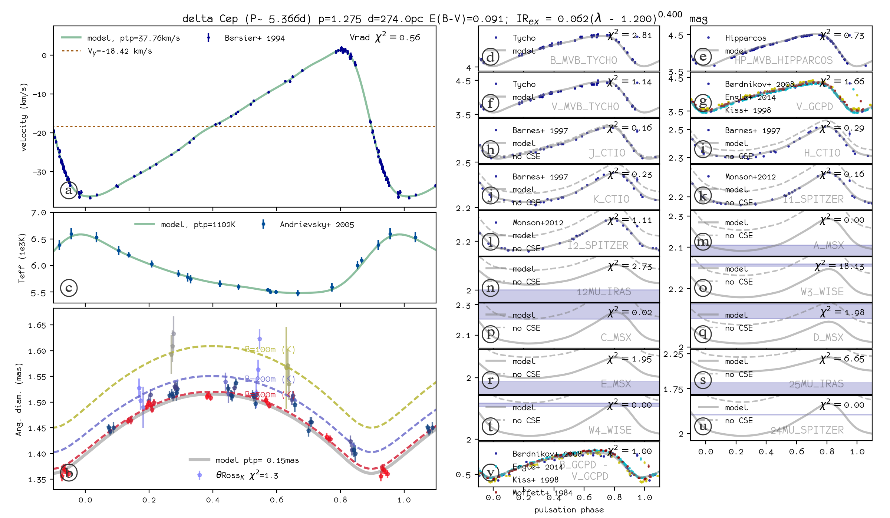

# Spectro Photo Interferometry of Pulsating stars

## What is this?

This is a python2.7 implementation of a parallax of pulsation method for Cepheids stars, described in [Mérand et al. (Astronomy & Astrophysics 584-80, 2015)](http://adsabs.harvard.edu/abs/2015A%26A...584A..80M). This is not meant as a well written code: this is a research code published for anyone willing to use it (providing you quote the aforementioned paper and you respect the license) to study Cepheids or reproduce results from these papers:
 - [Mérand et al. (2015)](http://adsabs.harvard.edu/abs/2015A%26A...584A..80M): "Cepheid distances from the SpectroPhoto-Interferometry of Pulsating Stars (SPIPS). Application to the prototypes delta Cephei and eta Aquilae"
 - [Breitfelder et al. (2015)](http://adsabs.harvard.edu/abs/2015A%26A...576A..64B): "Observational calibration of the projection factor of Cepheids. I. The type II Cepheid kappa Pavonis"
 - [Breitfelder et al. (2016)](http://adsabs.harvard.edu/abs/2016A%26A...587A.117B): "Observational calibration of the projection factor of Cepheids. II. Application to nine Cepheids with HST/FGS parallax measurements"
 - [Kervella et al. (2017)](http://adsabs.harvard.edu/abs/2017A%26A...600A.127K): "Observational calibration of the projection factor of Cepheids. III. The long-period Galactic Cepheid RS Puppis"

## Quick Start / Example

Quick Start:
 - download all files
 - in python2.7: `import delta_cep.py`
   - this will load spips.py
   - first time you load spips.py, lots of models will be downloaded: [ATLAS9 models](http://wwwuser.oats.inaf.it/castelli/grids.html) and [SATLAS models](http://cdsarc.u-strasbg.fr/viz-bin/Cat?J/A%2bA/554/A98).
 - run `delta_cep.show(delta_cep.p_fourier)` to show the model with Fourier parameters
 - run `delta_cep.show(delta_cep.p_splines)` to show the model with Splines parameters
 - run `delta_cep.fit(delta_cep.p_splines)` to run a fit. Check the inside of the function to see how it works.

The result of the model is shown below:

- the upper left panel shows the phased radial velocity data (points) and model (line)
- the middle left panel shows the phased effective temperature data (points) and model (line)
- the lower left panel shows the phased interferometric angular diameter data (points) and model (lines). Note that the different colors show the impact of the effects of the interferometric baseline on the diameter measurements, due to the presence of an circum-stellar envelop
- the panels on the right hand side show the photometric data. 

## Dependencies and known issues

- `numpy`
- `scipy` (version<0.19): The code is accelerated using [`scipy.weave`](https://docs.scipy.org/doc/scipy-0.18.1/reference/tutorial/weave.html) which has been deprecated in `scipy` version 0.19. Hence SPIPS currently only runs in a downgraded version of `scipy` of 0.18.
- `astropy.io.fits`

## License (BSD)

Copyright (c) 2017, Antoine Mérand
All rights reserved.

Redistribution and use in source and binary forms, with or without
modification, are permitted provided that the following conditions are met:

1. Redistributions of source code must retain the above copyright notice, this
   list of conditions and the following disclaimer.
2. Redistributions in binary form must reproduce the above copyright notice,
   this list of conditions and the following disclaimer in the documentation
   and/or other materials provided with the distribution.

THIS SOFTWARE IS PROVIDED BY THE COPYRIGHT HOLDERS AND CONTRIBUTORS "AS IS" AND
ANY EXPRESS OR IMPLIED WARRANTIES, INCLUDING, BUT NOT LIMITED TO, THE IMPLIED
WARRANTIES OF MERCHANTABILITY AND FITNESS FOR A PARTICULAR PURPOSE ARE
DISCLAIMED. IN NO EVENT SHALL THE COPYRIGHT OWNER OR CONTRIBUTORS BE LIABLE FOR
ANY DIRECT, INDIRECT, INCIDENTAL, SPECIAL, EXEMPLARY, OR CONSEQUENTIAL DAMAGES
(INCLUDING, BUT NOT LIMITED TO, PROCUREMENT OF SUBSTITUTE GOODS OR SERVICES;
LOSS OF USE, DATA, OR PROFITS; OR BUSINESS INTERRUPTION) HOWEVER CAUSED AND
ON ANY THEORY OF LIABILITY, WHETHER IN CONTRACT, STRICT LIABILITY, OR TORT
(INCLUDING NEGLIGENCE OR OTHERWISE) ARISING IN ANY WAY OUT OF THE USE OF THIS
SOFTWARE, EVEN IF ADVISED OF THE POSSIBILITY OF SUCH DAMAGE.
